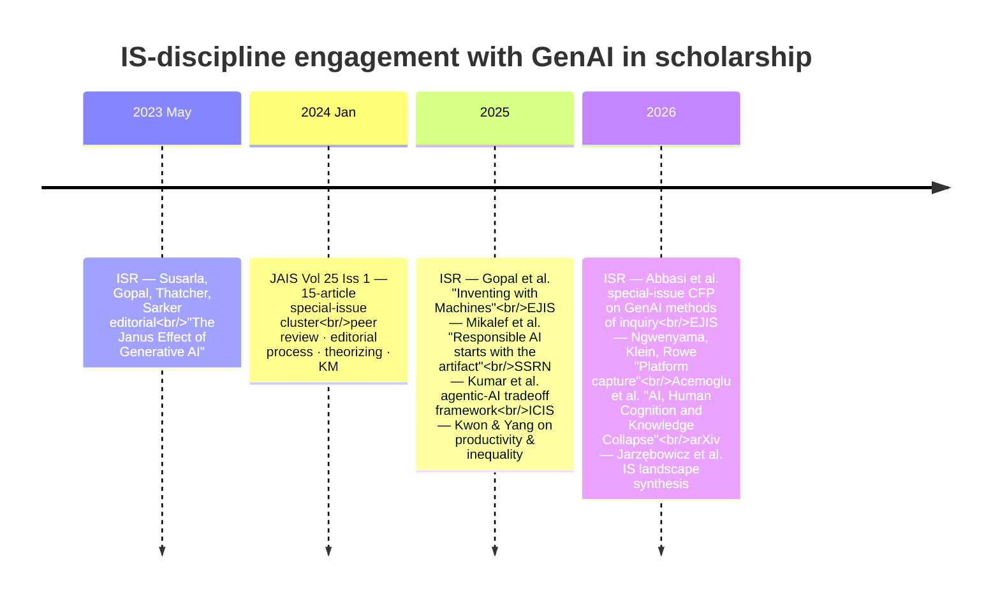

# The IS discipline and RISE

The Information Systems discipline has, in a remarkably short window
(2023–2026), produced a concentrated body of reflective scholarship on
how its own knowledge-production process should change when generative
AI participates in it. This page synthesizes that body of work,
organizes it into three threads, and connects each thread to the
[projects catalog](../projects/index.md).

The papers cited below are all indexed in the [papers
catalog](../papers/index.md). The synthesis is current as of
2026-05-17; new entries will continue to land in the catalog
without necessarily updating this page — treat this as a frozen-in-time
map, not a live one.

## A short timeline

Three points stand out:

1. **The senior editorial leadership of IS engaged early and explicitly.** The 2023 ISR editorial was written by the EIC and three of his closest collaborators ([@susarla2023janus]); the 2024 JAIS Vol 25 Iss 1 cluster includes Atreyi Kankanhalli (JAIS EIC), Ron Weber (former MISQ EIC), Shirley Gregor, and Sirkka Jarvenpaa. This was not a junior-scholar wave — it was a discipline-leadership statement.
2. **JAIS Vol 25 Iss 1 (Jan 2024) is the de facto special issue.** Fifteen articles, almost all dealing with how IS knowledge production must change. There is no other concentrated cluster of this size in the discipline.
3. **The 2026 ISR special-issue CFP ([@abbasi2026isr]) makes the agenda institutional.** It explicitly invites contributions where "GenAI must make a substantive and consequential contribution in the research process." The window for staking out the methodological ground is open now.

## Thread 1 — Peer review and the editorial process

The single most-developed sub-area. Five distinct positions are
visible in the cluster, and they map directly onto design choices in
the catalog's review-focused projects ([`ape`](../projects/ape.md),
[`reviewer`](../projects/reviewer.md), [`marg`](../projects/marg.md)).

- **The democratization argument** ([@sarker2024democratizing]).
  Human–AI peer review can close gaps between scholarly traditions
  and reduce gatekeeping. The proponents are the senior IS editorial
  community itself.
- **The two-axis design framework** ([@shmueli2024editorial]).
  *AI-augmented* (humans drive, AI assists) vs. *AI-driven* (AI
  drives, humans approve) — a 2×2 framework that maps almost
  one-to-one onto this catalog's `autonomy_level` scoring for
  review-focused projects.
- **The human-in-the-loop architecture** ([@drori2024humanloop]).
  A specific feasibility/risk analysis of HITL review designs — the
  most direct architectural reference for any RISE pipeline that
  embeds a review stage.
- **The RoboReviewer role** ([@weber2024roboreviewer]). Weber treats
  the AI not as an editorial tool but as *another reviewer* with
  characteristic strengths and blind spots. This framing is doing
  silent work in nearly every catalog entry that scores ≥ 1 on
  `internal_evaluation` via referee simulation.
- **The journal-policy stance** ([@kankanhalli2024peerreview],
  [@gregor2024responsible]). JAIS's editor and an ANU senior
  scholar lay out the institutional response: what journals do,
  not what tools do.

A direct critic is also present: [@gartenberg2026morebetter] in
Organization Science argues that AI may exacerbate, not solve, peer
review's "more vs better" tradeoff — relevant context for any RISE
project that frames AI peer review as unambiguous productivity gain.

**For RISE builders:** the [`reviewer`](../projects/reviewer.md) and
[`marg`](../projects/marg.md) projects implement the
human-in-the-loop and multi-agent positions, respectively;
[`ape`](../projects/ape.md) implements something closer to the
AI-driven end of [@shmueli2024editorial]'s two-axis framework. The
discipline-level question — whether peer review *should* be
algorithmically scaled at all — is open, and the IS papers above
are where it is being argued.

## Thread 2 — Theorizing, methodology, and the literature review

The IS discipline's second strong move is to ask whether GenAI changes
the *epistemic* status of scholarly work, not only its volume.

- **Literature reviews as epistemic act**
  ([@ngwenyama2024literature]). Frantz Rowe and Ojelanki Ngwenyama
  argue that AI-assisted literature reviews change the *values* of the
  resulting synthesis, not just its cost. The catalog's
  literature-synthesis projects ([`storm`](../projects/storm.md),
  [`open-scholar`](../projects/open-scholar.md),
  [`paper-qa`](../projects/paper-qa.md),
  [`gpt-researcher`](../projects/gpt-researcher.md)) answer "how";
  this paper asks "with what epistemic consequences."
- **Theorizing with a generative collaborator**
  ([@jarvenpaa2024theorizing]). Sirkka Jarvenpaa (UT Austin) and
  Stefan Klein (Münster) treat GenAI as a *theorizing partner* —
  beyond data analysis, into conceptual contribution. Methodologically
  ambitious; very few catalog projects currently target this level.
- **Knowledge creation/curation/consumption decomposition**
  ([@schwartz2024kcc]). Three-part decomposition of where AI fits in
  the scholarly workflow. Complements the inputs → knowledge
  production → outputs framing this site uses on the
  [landing diagram](../index.md).
- **Theory of causal-knowledge analytics** ([@watson2024causal]).
  Watson, Song, Zhao, and Webster sketch infrastructure for tracking
  causal claims across the literature — an under-developed
  knowledge-layer capability noted in [Knowledge layer](knowledge-layer.md).
- **The KM lens** ([@alavi2024kmperspective]). Alavi and Leidner —
  foundational KM scholars in IS — frame GenAI through the
  knowledge-management tradition. Establishes the genealogical link
  from KM to RISE.

The 2025 ISR editorial ([@gopal2025inventing]) reads as the
institutional successor to all of this: it explicitly invites IS
research that *uses* GenAI as a method of inquiry, not just as a
study subject. The 2026 ISR special-issue CFP ([@abbasi2026isr])
operationalizes that invitation.

**For RISE builders:** none of the catalog's end-to-end pipelines
yet attempt the kind of theoretical contribution
[@jarvenpaa2024theorizing] describe. The closest is
[`agent-laboratory`](../projects/agent-laboratory.md), which models
literature review and report writing but stops short of
theory-building. This is a clear gap.

## Thread 3 — Sociotechnical critique

The third thread sits in deliberate tension with the first two. It
asks: what are the second-order, field-level, political-economy
consequences of routing scholarship through AI?

- **The platform-capture argument** ([@ngwenyama2026platform]). The
  sharpest critical voice in the cluster. Using Marx's theory of
  subsumption, Ngwenyama, Klein, and Rowe argue that publisher
  platforms (Elsevier) — reinforced by GenAI — *subsume* academic
  labor itself. Every `focus: publishing` and `focus: end-to-end`
  project in the catalog operates inside the conditions this paper
  describes.
- **The responsible-AI artifact-first argument**
  ([@mikalef2025responsible]). The EJIS editorial team challenges
  principles-first responsible-AI frameworks: the artifact's
  intrinsic characteristics (agentic, autonomous, inscrutable,
  adaptable) often *conflict* with the principles. A direct
  methodological challenge to how RISE systems should be evaluated
  against governance norms.
- **Knowledge collapse** ([@acemoglu2026collapse]). Acemoglu, Kong,
  and Ozdaglar (MIT) model the macro risk: if humans defer to
  AI-generated knowledge faster than they verify it, the field's
  epistemic capital erodes. The field-level evaluation question
  raised in [Evaluation](evaluation.md) has its strongest
  theoretical formulation here.
- **Productivity with distributional cost**
  ([@kwon2025inequality]). ICIS 2025 paper documenting that the
  productivity gains documented in [@filimonovic2025genai] are
  *unequally distributed* — concentrating in well-resourced
  researchers. Combined, the two papers sketch a productivity-with-
  inequality story for RISE deployment.
- **Anthropomorphism** ([@peter2025anthropomorphic]) and
  **style-engines** ([@riemer2024styleengines]) extend the critique:
  what looks like AI scholarship is often AI performance of
  scholarship, and the catalog's projects with high `autonomy_level`
  scores are doing both jobs simultaneously.

**For RISE builders:** if your project sits high on the
`autonomy_level` and `lifecycle_coverage` dimensions, this thread is
the literature you need to engage with — not optionally, because it
forms the strongest available case that the work is harmful at the
field level. The catalog's evaluation rubric does not yet score
field-level risk; this is a candidate dimension for the next rubric
version.

## Cross-thread observations

### The author networks are tight

Several authors recur across threads — most notably **Ojelanki
Ngwenyama** (lit-review epistemics in JAIS, platform capture in EJIS),
**Frantz Rowe** (same), **Stefan Klein** (theorizing in JAIS,
platform capture in EJIS), **Dov Te'eni** (HITL reviewing,
knowledge-process decomposition), **Anjana Susarla** / **Ram Gopal**
/ **Jason Bennett Thatcher** / **Suprateek Sarker** (ISR Janus
editorial 2023, JAIS democratizing paper 2024, ISR Inventing
editorial 2025).

This is a *coherent intellectual community* doing the work, not a
scattered set of one-off engagements. The implication: a credible
RISE contribution should engage these authors directly, not work
around them.

### The geography is broader than the venues suggest

The cluster has strong representation from outside the US: Münster,
Galway, Trondheim, Wagga Wagga (ANU), Toronto, Cape Town, Nantes,
Israel, Singapore, Hsinchu. The 2026 EJIS papers in particular are
non-US-led. RISE positioning that is *only* US-centric is missing
where the discipline is actually thinking.

### The empirical work is thin (so far)

The cluster is overwhelmingly *conceptual* / *editorial* /
*position-paper* in genre. Empirical IS work on GenAI in research
practice exists (e.g., [@kwon2025inequality],
[@filimonovic2025genai], [@filimonovic2025genai],
[@bapna2025analytics]) but is the minority. **This is the open
opportunity for new RISE contributions:** empirical evaluation of
agentic-research systems against the methodological claims the
conceptual literature makes.

## Reading paths

If you have an hour:

1. [@gopal2025inventing] (15 min) — the agenda
2. [@sarker2024democratizing] (15 min) — the peer-review proposal
3. [@ngwenyama2026platform] (20 min) — the strongest critique
4. [@mikalef2025responsible] (10 min) — the governance challenge

If you have an afternoon, read the full
[JAIS Vol 25 Iss 1](https://aisel.aisnet.org/jais/vol25/iss1/) — it
is short, well-organized, and covers most of the discipline's stake
in one place.

If you want the macro / economic frame:
[@acemoglu2026collapse] + [@gartenberg2026morebetter] +
[@filimonovic2025genai].

If you want the agentic-AI engineering frame (the other side of
the same conversation): the catalog's
[projects index](../projects/index.md).
