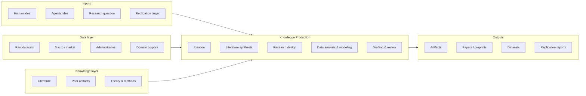

# Anatomy of a RISE pipeline

The landing-page diagram is a coarse model. This page expands each
block into its operational components and points to the projects in
the [catalog](../projects/index.md) that realize them concretely.

## Inputs

A RISE system is specified in part by *what it accepts as a starting
point*. Catalog entries declare an `inputs:` field; common values:

- **Human idea** — an underspecified prompt from a researcher
  ("something about momentum in crypto markets").
- **Agentic idea** — an idea produced by an upstream ideation loop;
  characteristic of systems that chain ideation and execution
  (e.g., the Sakana AI Scientist lineage).
- **Research question** — a fully specified, identification-aware RQ
  with a stated population, treatment, outcome, and design.
- **Replication target** — a published paper whose results the pipeline
  must reproduce ([`social-science-replicability`](../projects/social-science-replicability.md)).
- **Submitted paper** — for review-focused systems
  ([`ape`](../projects/ape.md), [`reviewer`](../projects/reviewer.md),
  [`marg`](../projects/marg.md)).

The breadth of supported inputs is one of the eight evaluation
dimensions; an input-narrow system can still be excellent at what it
does.

## Knowledge Production (the core)

The agentic pipeline itself. Stages defined in
[`projects/VOCABULARY.md`](https://github.com/bhanneke/RISE/blob/main/projects/VOCABULARY.md):

| Stage | What happens | Reference systems |
|---|---|---|
| `rq-formulation` | Sharpen an underspecified prompt into a research question. | `e2er`, `agent-laboratory` |
| `hypothesis-generation` | Generate testable hypotheses. | `sakana-ai-scientist`, `robin`, `agent-laboratory` |
| `literature-discovery` | Find relevant papers. | `storm`, `paper-qa`, `open-scholar`, `gpt-researcher` |
| `literature-synthesis` | Summarize, integrate, identify gaps. | `storm`, `paper-qa`, `open-scholar` |
| `research-design` | Choose method, identification, data plan. | `e2er`, `agent-laboratory`, `robin` |
| `data-acquisition` | Fetch, scrape, request data. | `e2er`, `social-science-replicability` |
| `data-analysis` | Clean, explore, estimate. | `e2er`, `agent-laboratory`, `social-science-replicability` |
| `formal-modeling` | Theoretical / mathematical models. | `e2er` |
| `code-generation` | Produce analysis or replication code. | `agent-laboratory`, `sakana-ai-scientist` |
| `paper-drafting` | First-draft paper sections. | `zeropaper`, `agent-laboratory`, `sakana-ai-scientist` |
| `revision-editing` | Refine prose, structure, argumentation. | `refine-ink`, `coarse-ink` |
| `referee-simulation` | Pre-submission peer review. | `ape`, `reviewer`, `marg` |
| `replication` | Reproduce a published paper's results. | `social-science-replicability` |
| `dissemination` | Format for journals/preprints. | *(none yet in catalog)* |

Implementations differ on three orthogonal axes:

- **Autonomy** — copilot, supervised agent, autonomous, or
  society-of-agents. The [evaluation rubric](https://github.com/bhanneke/RISE/blob/main/projects/EVALUATION.md)
  scores this 0–3.
- **Topology** — directed acyclic graph, iterative loop, debate /
  consensus, or hybrid. Tagged in
  [`architectural_features`](https://github.com/bhanneke/RISE/blob/main/projects/VOCABULARY.md).
- **Stage coverage** — single-stage tool ↔ end-to-end pipeline.
  Tagged via `pipeline_stages` and headline `focus`.

## Data layer (left input)

The empirical material the pipeline operates on. Sources are
heterogeneous and per-domain: market data feeds, administrative
records, biological-sequence databases, user-supplied PDFs.

See [Data layer](data-layer.md) for the typology and access-pattern
discussion.

## Knowledge layer (right input)

Prior scholarship: literature, citations, theory, reusable methods.
The catalog's literature-focused projects ([`paper-qa`](../projects/paper-qa.md),
[`open-scholar`](../projects/open-scholar.md),
[`storm`](../projects/storm.md)) live primarily in this layer.

See [Knowledge layer](knowledge-layer.md).

## Outputs

A RISE system is characterized by *what it produces durably*.
Catalog entries declare an `outputs:` field; common values:

- **Artifacts** — code, figures, tables, prompts, intermediate notes.
- **Papers / preprints** — the most public output type.
- **Datasets** — curated, often a by-product of the pipeline.
- **Replication reports** — structured comparison of pipeline output
  vs. a published target.
- **Referee reports** — structured peer reviews.

Output reproducibility is scored on the evaluation rubric: a system
that drops outputs to disk in a versioned, re-runnable form scores
higher than one whose terminal artifact is ephemeral.

## What is *not* in this diagram (yet)

Three blocks are conspicuously absent and likely need explicit
treatment in a future revision:

- **Submission and venue routing.** Where do papers go, and how is
  that decision made?
- **Ethics and IRB-equivalent gates.** For studies involving human
  subjects, animal subjects, or sensitive data.
- **Post-publication revision and retraction.** How an output is
  maintained over time.

These belong in the diagram but no project in the current catalog
implements them. Pull requests welcome.
