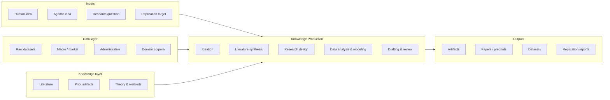

# Anatomy of a RISE pipeline

> *Stub — content to be developed in Phase 2.*

This page expands the landing-page diagram into a working anatomy.

## Inputs

- **Human idea** — an underspecified prompt from a researcher.
- **Agentic idea** — an idea generated by an upstream agent (ideation
  loop, prior-paper extension).
- **Research question** — a fully specified, identification-aware RQ.
- **Replication target** — a published paper whose results the pipeline
  must reproduce.

## Knowledge Production (the core)

The agentic pipeline itself. Implementations vary on **autonomy**,
**topology** (DAG vs. loop vs. debate), and **stage coverage**. See
the [evaluation rubric](../../projects/EVALUATION.md) for how these
are scored, and the [projects catalog](../../projects/index.md) for
how concrete systems realize each choice.

## Data layer (left input)

See [Data layer](data-layer.md).

## Knowledge layer (right input)

See [Knowledge layer](knowledge-layer.md).

## Outputs

- **Artifacts** — code, figures, tables, prompts, intermediate notes.
- **Papers / preprints** — the most public output type.
- **Datasets** — curated, often by-product of the pipeline.
- **Replication reports** — a structured comparison of pipeline output
  vs. a published target.
