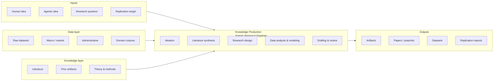

# Research Information Systems Engineering

**RISE** is a public knowledge base introducing *Research Information
Systems Engineering* — the design and study of information systems
that **produce scholarly knowledge**, with a focus on agentic research
pipelines.

The repository maintains two curated catalogs:

1. an **academic-papers database** of structured notes on the literature
   that frames RISE;
2. a **projects database** that evaluates agentic research systems
   against a [standard rubric](../projects/EVALUATION.md).

---

## The RISE pipeline at a glance

A RISE system is any information system that implements some non-trivial
portion of this diagram. Different systems differ in:

- **which inputs** they accept (some take only a fully specified RQ;
  others ideate from scratch);
- **how broadly** they cover the pipeline (single-stage tools vs.
  end-to-end pipelines);
- **how autonomously** the pipeline operates (copilot ↔ society of agents);
- **what artifacts** they produce, and to what reproducibility standard.

The [projects catalog](../projects/index.md) scores every system on
these dimensions using the [evaluation rubric](../projects/EVALUATION.md).

---

## How to use this site

| If you are… | Start at |
|-------------|----------|
| New to the topic | [Concept → Definition](concept/definition.md) |
| Looking for the diagram explained | [Concept → Pipeline anatomy](concept/pipeline-anatomy.md) |
| Surveying existing systems | [Projects](../projects/index.md) |
| Looking for the literature | [Papers](../papers/index.md) |
| Wanting to contribute | [Contributing](contributing.md) |

## Provenance

This knowledge base is curated by [Björn Hanneke](https://github.com/bhanneke)
(Goethe University Frankfurt). It is licensed CC-BY-4.0; please cite per
[`CITATION.cff`](https://github.com/bhanneke/RISE/blob/main/CITATION.cff).
