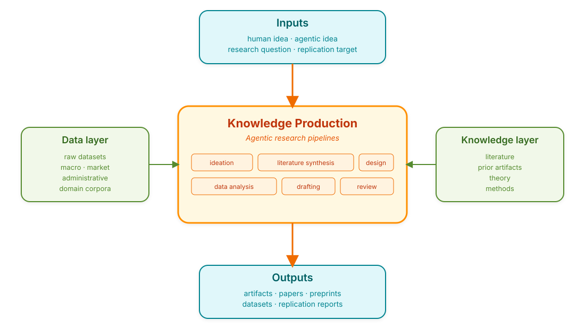

# Research Information Systems Engineering

**RISE** is a public knowledge base introducing *Research Information
Systems Engineering* — a framework for **designing, operating, and
governing AI-enabled research systems**: information systems whose
primary purpose is to produce scholarly knowledge with at least
partial mediation by AI agents.

The motivating premise is that GenAI is becoming part of the
*infrastructure* of scientific work, which creates a need for
institutional guardrails grounded in a systematic understanding of
these systems — their architectures, human roles, provenance
mechanisms, failure modes, and evaluation criteria. See
[Concept → Definition](concept/definition.md) for the full framing.

The repository maintains three curated catalogs:

1. an **academic-papers database** of structured notes on the literature
   that frames RISE;
2. a **projects database** that evaluates agentic research systems
   against a [standard rubric](https://github.com/bhanneke/RISE/blob/main/projects/EVALUATION.md);
3. a **skills database** of reusable Markdown skill files curated from
   open agentic-research projects.

---

## The RISE pipeline at a glance

  

A RISE system is any information system that implements some non-trivial
portion of this diagram. Different systems differ in:

- **which inputs** they accept (some take only a fully specified RQ;
  others ideate from scratch);
- **how broadly** they cover the pipeline (single-stage tools vs.
  end-to-end pipelines);
- **how autonomously** the pipeline operates (copilot ↔ society of agents);
- **what artifacts** they produce, and to what reproducibility standard.

The [projects catalog](projects/index.md) scores every system on
these dimensions using the [evaluation rubric](https://github.com/bhanneke/RISE/blob/main/projects/EVALUATION.md).

---

## How to use this site

| If you are… | Start at |
|-------------|----------|
| New to the topic | [Concept → Definition](concept/definition.md) |
| Looking for the diagram explained | [Concept → Pipeline anatomy](concept/pipeline-anatomy.md) |
| Surveying existing systems | [Projects](projects/index.md) |
| Looking for the literature | [Papers](papers/index.md) |
| Looking for reusable agent skills | [Skills](skills/index.md) |
| Wanting to contribute | [Contributing](contributing.md) |
| Wanting to cite this site | [About / Cite](about.md) |

## Provenance

This knowledge base is curated by [Björn Hanneke](https://github.com/bhanneke)
(Goethe University Frankfurt), with research and evaluation supported by
**[Claude Code](https://www.anthropic.com/claude-code)** (Anthropic) —
project audits, paper-note drafting, PDF-text extraction, and rubric
scoring are produced through Claude Code workflows under the curator's
review.

> **Hobby project — not (yet) a scientific contribution.** RISE is a
> living catalog assembled in the open. Claims, scorings, and
> classifications reflect the curator's current best-effort
> understanding of fast-moving primary sources; they have not been
> peer-reviewed, and the rubric (v0.2) is itself a working artifact.
> Use it as a navigable map of the field, not as a citable evaluation
> of any individual project. Corrections and additions welcome via
> pull request.

Licensed CC-BY-4.0; please cite per
[`CITATION.cff`](https://github.com/bhanneke/RISE/blob/main/CITATION.cff).
